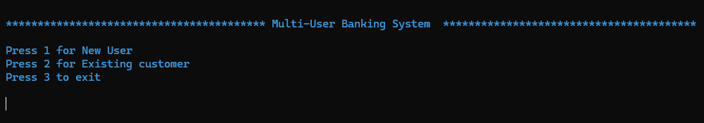
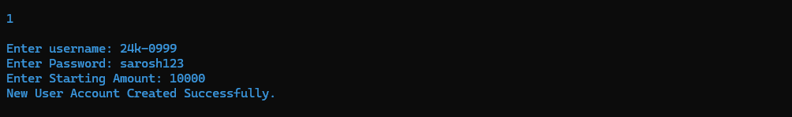
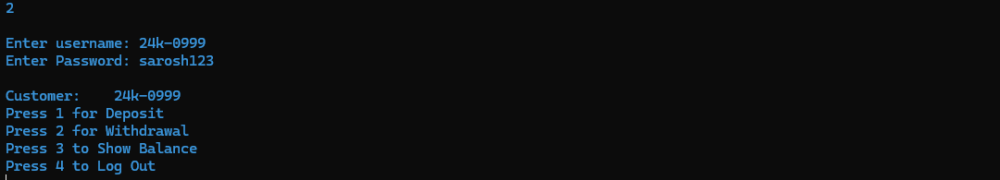
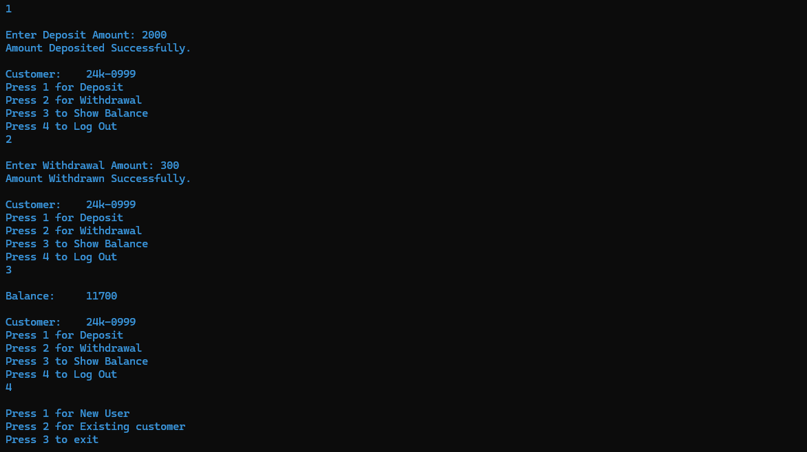
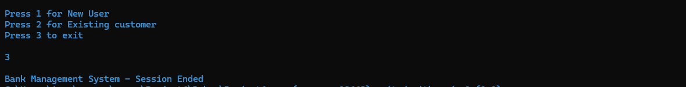

# Bank Management System

## Table of Contents
- [Overview](#overview)
- [Functions](#functions)
- [Screenshots](#screenshots--demo)
- [Installation](#installation)
- [Contributors](#contributors)

## Overview
This is a Bank Management System using Assembly Language (EMU8086 with MASM). The system allows the customer to create an account, log in, deposit money, withdraw money, view balance, and save updated balance to a file. The project demonstrates low-level concepts such as file handling, string manipulation, memory addressing, and interrupts.
## Functions
- Account creation
- Username and Password Validation
- Deposit and Withdrawal with error handling
- Display customer details
- Save, updates balance to file

## Screenshots

### Menu

---
### New User

---
### Existing User

---
### Deposit, Withdraw, Show Operations

---
### Exit

---

- ### Requirements
    - Assembly Language (Irvine32 library)
    - EMU 8086

## Future Improvements
- ### Include checks for corrupted files and auto-create them when needed.
- ### Add balance transfer, PIN change, and account deletion options.

## Contributors

